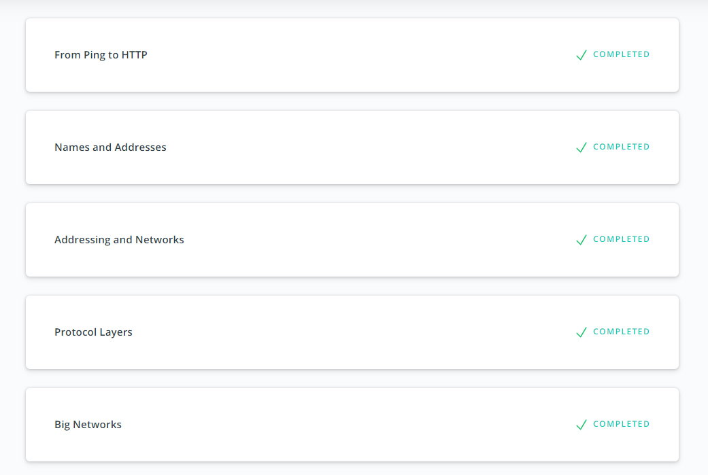

# Kottans backend course 
## Git and GitHub, Unix Shell

Previously completed in scope of [frontend course](https://github.com/Xsorter/kottans_frontend)

## NodeJS Basics 1

Interesting set of tiny well-structured workshops. Except subtask about functional javascript all information was new for me. I was curious to know how things with streams works in NodeJS. It's a bit similar with Ngrx, but still was fully new for me.


## Memory Management

> What's going to happen if program reaches maximum limit of stack ?

Stack owerflow will happen.

> What's going to happen if program requests a big (more then 128KB) memory allocation on heap ?

Heap will enlarge with a help of system call and will change the data segment size. 

> What's the difference between Text and Data memory segments ?

Text segment contains read-only data for execution. Data segment contains data which is already defined in code for static variables initialization.

```55d0f41c0000-55d0f425b000 r-xp 00000000 fd:00 73759                      /bin/bash
55d0f425b000-55d0f425f000 r--p 0009a000 fd:00 73759                      /bin/bash
55d0f425f000-55d0f4262000 rw-p 0009e000 fd:00 73759                      /bin/bash
55d0f4262000-55d0f4266000 rw-p 00000000 00:00 0 
55d0f61a6000-55d0f62cf000 rw-p 00000000 00:00 0                          [heap]
78e3c04ca000-78e3c0665000 r--p 00000000 fd:00 91249                      /usr/lib64/locale/locale-archive
78e3c0665000-78e3c0815000 r-xp 00000000 fd:00 16410                      /lib64/libc-2.27.so
78e3c0815000-78e3c0a14000 ---p 001b0000 fd:00 16410                      /lib64/libc-2.27.so
78e3c0a14000-78e3c0a18000 r--p 001af000 fd:00 16410                      /lib64/libc-2.27.so
78e3c0a18000-78e3c0a1a000 rw-p 001b3000 fd:00 16410                      /lib64/libc-2.27.so
78e3c0a1a000-78e3c0a1e000 rw-p 00000000 00:00 0 
78e3c0a1e000-78e3c0a45000 r-xp 00000000 fd:00 16412                      /lib64/ld-2.27.so
78e3c0bc5000-78e3c0bc8000 rw-p 00000000 00:00 0 
78e3c0bc8000-78e3c0bee000 r-xp 00000000 fd:00 16510                      /lib64/libtinfo.so.5.9
78e3c0bee000-78e3c0bf2000 r--p 00025000 fd:00 16510                      /lib64/libtinfo.so.5.9
78e3c0bf2000-78e3c0bf3000 rw-p 00029000 fd:00 16510                      /lib64/libtinfo.so.5.9
78e3c0bf3000-78e3c0c2d000 r-xp 00000000 fd:00 16516                      /lib64/libreadline.so.6.3
78e3c0c2d000-78e3c0c30000 r--p 00039000 fd:00 16516                      /lib64/libreadline.so.6.3
78e3c0c30000-78e3c0c36000 rw-p 0003c000 fd:00 16516                      /lib64/libreadline.so.6.3
78e3c0c36000-78e3c0c39000 rw-p 00000000 00:00 0 
78e3c0c45000-78e3c0c46000 r--p 00027000 fd:00 16412                      /lib64/ld-2.27.so
78e3c0c46000-78e3c0c47000 rw-p 00028000 fd:00 16412                      /lib64/ld-2.27.so
78e3c0c47000-78e3c0c48000 rw-p 00000000 00:00 0 
7ffdbe689000-7ffdbe6aa000 rw-p 00000000 00:00 0                          [stack]
7ffdbe7dd000-7ffdbe7e0000 r--p 00000000 00:00 0                          [vvar]
7ffdbe7e0000-7ffdbe7e2000 r-xp 00000000 00:00 0                          [vdso]
ffffffffff600000-ffffffffff601000 r-xp 00000000 00:00 0                  [vsyscall]
```

Memory Mapping Segment - 78e3c0665000-78e3c0815000  
Heap - 55d0f61a6000-55d0f62cf000  
Stack - 7ffdbe689000-7ffdbe6aa000  

## TCP. UDP. Network



All materials was pretty understandble. "How dns works" is very funny resource which can help a lot to understand dns functionality.