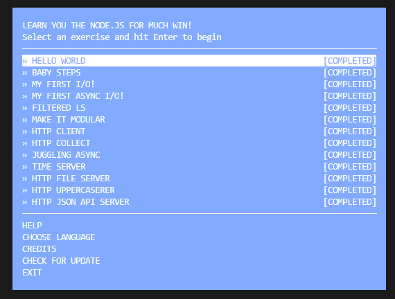
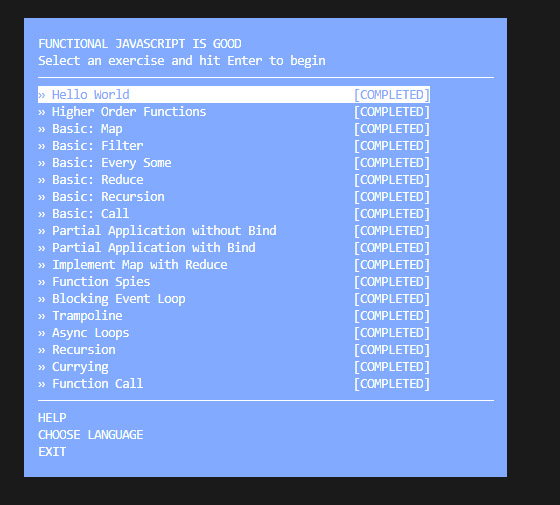
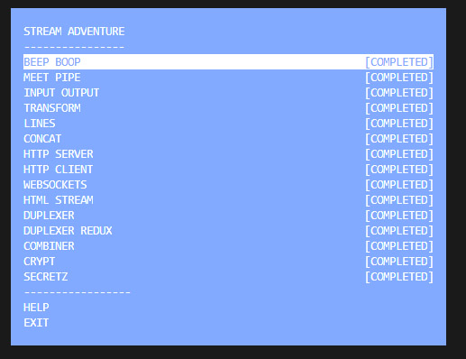

# Kottans backend course 
## Git and GitHub, Unix Shell

Previously completed in scope of [frontend course](https://github.com/Xsorter/kottans_frontend)

## NodeJS Basics 1

Interesting set of tiny well-structured workshops. Except subtask about functional javascript all information was new for me. I was curious to know how things with streams works in NodeJS. It's a bit similar with Ngrx, but still was fully new for me.

## Memory Management

> What's going to happen if program reaches maximum limit of stack ?
Stack owerflow will happen.

> What's going to happen if program requests a big (more then 128KB) memory allocation on heap ?
Heap will enlarge with a help of system call and will change the data segment size. 

> What's the difference between Text and Data memory segments ?
Text segment contains read-only data for execution. Data segment contains data which is already defined in code for static variables initialization.